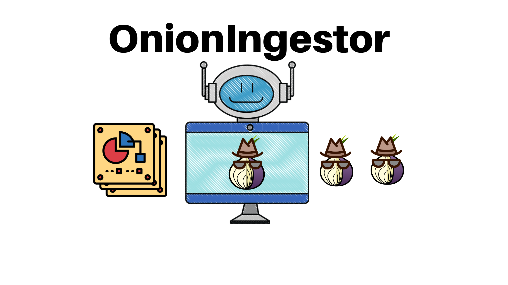
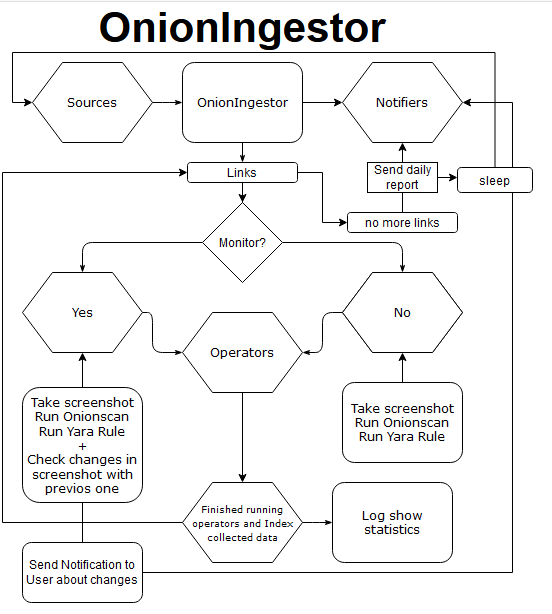
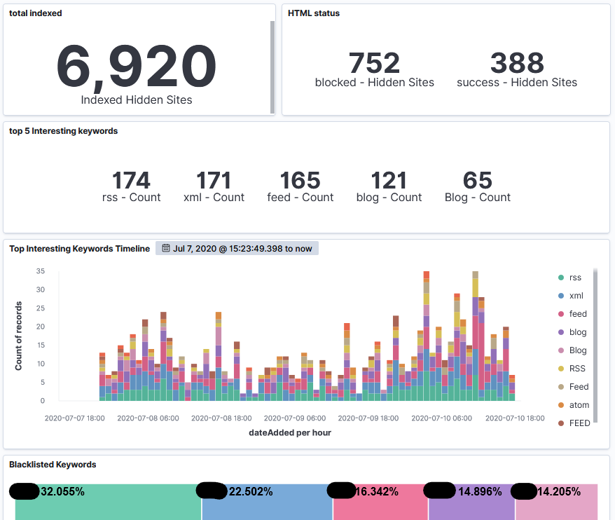

<p align="center">
  
</p>

<h1 align="center">OnionIngestor</h1>
<p align="center">
  <a href="https://python.org/">
    
  </a>
   <a href="https://opensource.org">
    
   </a>
   <a href="https://t.me/blueteamzone">
    
   </a>
   <a href="https://twitter.com/daniele_perera/">
    
   </a>
</p>

<p align="center">
  An extendable tool to Collect, Crawl and Monitor onion sites on tor network and index collected information on Elasticsearch
</p>

## Introduction

OnionIngestor is based on ThreatIngestor tool structure to enable modular and extendable access for Cyber Threat Intelligence teams so that they can monitor and collect information on hidden sites over tor network.

The project is at it's early stages of development.

## To-do-list

- [ ] Add multiprocessing to improve analyzing speed
- [ ] Add more sources like reddit, gmail, pastebin, twitter and other hidden sites
- [ ] Add more operators like checking changes of the screenshots for monitoring sites, adding yara rules to eliminate false positives
- [ ] Add more notifiers like slack, smpt, discord

## Basic Implementation Logic

The OnionIngestor runs and managers 3 important type of classes:
Sources - These will collect hidden sites from clear net sources like pastebin, twitter, gist and crawled links
Operators - These will process the onion link. For example get the html, take screenshots and run other scanners like [onionscan](https://github.com/s-rah/onionscan)
Notifiers - These will notify the user - daily with a report and if any new changes has occured to a monitoring hidden site

OnionIngestor is designed to run as a daemon where it collects hidden sites from enabled sources and pass it to the operators and
when finished sleep until user defined time and restart the process from the beginning.
<p align="center">
  
</p>

## Kibana Dashboard 

Dashboard kibana after 2 days of crawling

<p align="center">
  
</p>

## Installation

Install requirements
```
    pip install -r requirements.txt
```

After the tor client and the installed libraries use the `--help` command to get details of its use.

```
python3 -m onionscraper --help

OnionScraper

An extendable tool to Collect, Crawl and Monitor onion sites on tor network and index collected information on Elasticsearch

Installation:
   This application assumes you have python3 and pip3 installed.

   pip3 install -r requirements.txt

This software is provided subject to the MIT license stated below.
--------------------------------------------------
        MIT License

        Permission is hereby granted, free of charge, to any person obtaining a copy
        of this software and associated documentation files (the "Software"), to deal
        in the Software without restriction, including without limitation the rights
        to use, copy, modify, merge, publish, distribute, sublicense, and/or sell
        copies of the Software, and to permit persons to whom the Software is
        furnished to do so, subject to the following conditions:

        The above copyright notice and this permission notice shall be included in all
        copies or substantial portions of the Software.

        THE SOFTWARE IS PROVIDED "AS IS", WITHOUT WARRANTY OF ANY KIND, EXPRESS OR
        IMPLIED, INCLUDING BUT NOT LIMITED TO THE WARRANTIES OF MERCHANTABILITY,
        FITNESS FOR A PARTICULAR PURPOSE AND NONINFRINGEMENT. IN NO EVENT SHALL THE
        AUTHORS OR COPYRIGHT HOLDERS BE LIABLE FOR ANY CLAIM, DAMAGES OR OTHER
        LIABILITY, WHETHER IN AN ACTION OF CONTRACT, TORT OR OTHERWISE, ARISING FROM,
        OUT OF OR IN CONNECTION WITH THE SOFTWARE OR THE USE OR OTHER DEALINGS IN THE
        SOFTWARE.
--------------------------------------------------

optional arguments:
  -h, --help            show this help message and exit
  -c CONFIGFILE, --config CONFIGFILE
                        Path to config file
  --log {DEBUG,INFO,WARNING,ERROR,CRITICAL}
                        Set the logging level, default is INFO

```

The yaml config file contains all the information for OnionIngestor to work

## How-to-run

`python -m onionscan -c config.yml`

will run source modules to collect onion linkd from internet and run all operators to collect and crawl

`python -m onionscan -c config.yml --monitor thisIsAnOnionSiteLink.onion thisIsAnOnionSiteLink.onion`

monitor mode bypasses all type of blacklists

`python -m onionscan -c config.yml --scan thisIsAnOnionSiteLink.onion`

will run all operators without running any source modules

### Operator [Onionscan](https://github.com/s-rah/onionscan)
	onionscan --mode analysis -verbose -webport 8081

To run the webapp by onionscan

## Output

The output of the result is json, and in the same format it is sent to the chosen syslog.

```
{
  "_index": "darkweb",
  "_type": "_doc",
  "_id": "ogIkEHMBlDh8pb-30_2O",
  "_score": 1,
  "_source": {
    "onionscan": {
      "hiddenService": "nzxj65x32vh2fkhk.onion",
      "dateScanned": "2020-07-02T15:27:18.443234981Z",
      "online": false,
      "performedScans": [
        "web",
        "tls",
        "ssh",
        "irc",
        "ricochet",
        "ftp",
        "smtp",
        "mongodb",
        "vnc",
        "xmpp",
        "bitcoin",
        "bitcoin_test",
        "litecoin",
        "dogecoin"
      ],
      "webDetected": true,
      "tlsDetected": false,
      "sshDetected": false,
      "ricochetDetected": false,
      "ircDetected": false,
      "ftpDetected": false,
      "smtpDetected": false,
      "bitcoinDetected": false,
      "mongodbDetected": false,
      "vncDetected": false,
      "xmppDetected": false,
      "skynetDetected": false,
      "pgpKeys": null,
      "certificates": null,
      "bitcoinServices": {
        "bitcoin": {
          "detected": false,
          "userAgent": "",
          "prototocolVersion": 0,
          "onionPeers": null
        },
        "bitcoin_test": {
          "detected": false,
          "userAgent": "",
          "prototocolVersion": 0,
          "onionPeers": null
        },
        "dogecoin": {
          "detected": false,
          "userAgent": "",
          "prototocolVersion": 0,
          "onionPeers": null
        },
        "litecoin": {
          "detected": false,
          "userAgent": "",
          "prototocolVersion": 0,
          "onionPeers": null
        }
      },
      "sshKey": "",
      "sshBanner": "",
      "ftpFingerprint": "",
      "ftpBanner": "",
      "smtpFingerprint": "",
      "smtpBanner": "",
      "lastAction": "dogecoin",
      "timedOut": false,
      "error": null,
      "identifierReport": {
        "privateKeyDetected": false,
        "foundApacheModStatus": false,
        "serverVersion": "",
        "relatedOnionServices": null,
        "relatedOnionDomains": null,
        "ipAddresses": null,
        "emailAddresses": [
	  OMMITTED
        ],
        "analyticsIDs": null,
        "bitcoinAddresses": [
          "1A3usPsRyCRPy9z5zpaQoj59hTATnS799d",
          "114LbUUXsLc6QynxsTVLcAgHzEkSBB5Yww",
          "3FMRCWEv7XqW26mqe526s4ibmEz9qJSmt6",
          "19iqYbeATe4RxghQZJnYVFU4mjUUu76EA6",
          "3MV9ESE7CTjGJRivnXCE4MUnzpxAYnJNLT",
          "37VbgjzwVrM93g6zQrc4XP5RonpwnwKevj",
          "1HtuUatKrJSR8PYs2qSxnxvPuYhf8UiCpB",
          "1gzm7L4GNbNDUkfWZxQJdZt6b7tjoWzRb",
          "112dznTAr3m1PHnkQYK5CpsDJboEiCScwP"
        ],
        "linkedOnions": [
          "fagnojbvbqey34qd.onion",
          "ytxmxncdn2tjyzid.onion",
          "7rsgftiskp4xqlqd.onion",
          "hkcr7naqdkmw76gr.onion",
          "torbox3uiot6wchz.onion",
          "w5oxf255cjcziyyd.onion",
          "7g525hcd4cyowmid.onion",
          "uaciqctyky5olsid.onion",
          "2rdyr63onwhqp3qd.onion",
          "dreamdogehwnde5b.onion",
          "e5to4n5a325lvsad.onion",
          "xwwcqj3jt4dbfeid.onion",
          "cryptoupei2am6si.onion",
          "o5kq76skl2em3xad.onion",
          "k2hwrssoj7yivhid.onion",
          "x3dphthawcqtd4id.onion"
        ],
        "openDirectories": null,
        "exifImages": null
      },
      "crawls": [
        "http://nzxj65x32vh2fkhk.onion/",
        "http://nzxj65x32vh2fkhk.onion/all",
        "http://nzxj65x32vh2fkhk.onion/all?page=1",
        "http://nzxj65x32vh2fkhk.onion/all?page=2",
        "http://nzxj65x32vh2fkhk.onion/all?page=3",
        "http://nzxj65x32vh2fkhk.onion/assets/bootstrap/css/bootstrap.min.css",
        "http://nzxj65x32vh2fkhk.onion/assets/bootstrap/css/phpdiff.css",
        "http://nzxj65x32vh2fkhk.onion/assets/bootstrap/css/stickynotes.css",
        "http://nzxj65x32vh2fkhk.onion/assets/bootstrap/img/favicon.png",
        "http://nzxj65x32vh2fkhk.onion/assets/bootstrap/js/bootstrap.min.js",
        "http://nzxj65x32vh2fkhk.onion/assets/bootstrap/js/jquery.cookie.js",
        "http://nzxj65x32vh2fkhk.onion/assets/bootstrap/js/jquery.min.js",
        "http://nzxj65x32vh2fkhk.onion/assets/bootstrap/js/jquery.scrollto.js",
        "http://nzxj65x32vh2fkhk.onion/assets/bootstrap/js/stickynotes.js",
        "http://nzxj65x32vh2fkhk.onion/diff/ptoft0c1l/pbbofkqn1",
        "http://nzxj65x32vh2fkhk.onion/docs",
        "http://nzxj65x32vh2fkhk.onion/feed",
        "http://nzxj65x32vh2fkhk.onion/p0v6zvoin",
        "http://nzxj65x32vh2fkhk.onion/p0v6zvoin/ac3zze/raw",
        "http://nzxj65x32vh2fkhk.onion/p8nqdddzb",
        "http://nzxj65x32vh2fkhk.onion/p8nqdddzb/wafcdu/raw",
        "http://nzxj65x32vh2fkhk.onion/p8qorgjj2",
        "http://nzxj65x32vh2fkhk.onion/p8qorgjj2/duswuw/raw",
        "http://nzxj65x32vh2fkhk.onion/pawgypvjz",
        "http://nzxj65x32vh2fkhk.onion/pawgypvjz/7artey/raw",
        "http://nzxj65x32vh2fkhk.onion/pbbofkqn1",
        "http://nzxj65x32vh2fkhk.onion/pbbofkqn1/j5n49p/raw",
        "http://nzxj65x32vh2fkhk.onion/pdmtzkwup",
        "http://nzxj65x32vh2fkhk.onion/pdmtzkwup/jfm68l/raw",
        "http://nzxj65x32vh2fkhk.onion/pdot84cmm",
        "http://nzxj65x32vh2fkhk.onion/pdot84cmm/cgj4qw/raw",
        "http://nzxj65x32vh2fkhk.onion/pdubkxy1v",
        "http://nzxj65x32vh2fkhk.onion/pdubkxy1v/i3nrxl/raw",
        "http://nzxj65x32vh2fkhk.onion/pegkdomcx",
        "http://nzxj65x32vh2fkhk.onion/pegkdomcx/s4yquj/raw",
        "http://nzxj65x32vh2fkhk.onion/pfgafcrvp",
        "http://nzxj65x32vh2fkhk.onion/pfgafcrvp/kxj5lj/raw",
        "http://nzxj65x32vh2fkhk.onion/ph62mpvce",
        "http://nzxj65x32vh2fkhk.onion/ph62mpvce/kmqnwb/raw",
        "http://nzxj65x32vh2fkhk.onion/pjfn3yclj",
        "http://nzxj65x32vh2fkhk.onion/pjfn3yclj/u6o2wm/raw",
        "http://nzxj65x32vh2fkhk.onion/pkjhtx8tn",
        "http://nzxj65x32vh2fkhk.onion/pkjhtx8tn/mgqope/raw",
        "http://nzxj65x32vh2fkhk.onion/pl6wwk9go",
        "http://nzxj65x32vh2fkhk.onion/pl6wwk9go/4n2h7m/raw",
        "http://nzxj65x32vh2fkhk.onion/poppwa9mo",
        "http://nzxj65x32vh2fkhk.onion/poppwa9mo/52keri/raw",
        "http://nzxj65x32vh2fkhk.onion/ppez6ok6r",
        "http://nzxj65x32vh2fkhk.onion/ppez6ok6r/xtgf4l/raw",
        "http://nzxj65x32vh2fkhk.onion/pqnih2eus",
        "http://nzxj65x32vh2fkhk.onion/pqnih2eus/mchmij/raw",
        "http://nzxj65x32vh2fkhk.onion/private_key",
        "http://nzxj65x32vh2fkhk.onion/psfl80ry1",
        "http://nzxj65x32vh2fkhk.onion/psfl80ry1/fzpoil/raw",
        "http://nzxj65x32vh2fkhk.onion/pswvhb2u2",
        "http://nzxj65x32vh2fkhk.onion/pswvhb2u2/bwypdr/raw",
        "http://nzxj65x32vh2fkhk.onion/psxsbptqy",
        "http://nzxj65x32vh2fkhk.onion/psxsbptqy/ac2fwg/raw",
        "http://nzxj65x32vh2fkhk.onion/ptoft0c1l",
        "http://nzxj65x32vh2fkhk.onion/ptoft0c1l/jekdce/raw",
        "http://nzxj65x32vh2fkhk.onion/pufx3aabu",
        "http://nzxj65x32vh2fkhk.onion/pufx3aabu/jkf8k7/raw",
        "http://nzxj65x32vh2fkhk.onion/pvxlo9hda",
        "http://nzxj65x32vh2fkhk.onion/pvxlo9hda/tx5qns/raw",
        "http://nzxj65x32vh2fkhk.onion/pweo3qenp",
        "http://nzxj65x32vh2fkhk.onion/pweo3qenp/fjn8ok/raw",
        "http://nzxj65x32vh2fkhk.onion/pwgegfzoe",
        "http://nzxj65x32vh2fkhk.onion/pwgegfzoe/ad13am/raw",
        "http://nzxj65x32vh2fkhk.onion/pxn7di53e",
        "http://nzxj65x32vh2fkhk.onion/pxn7di53e/7gqdtb/raw",
        "http://nzxj65x32vh2fkhk.onion/pxppe2cwf",
        "http://nzxj65x32vh2fkhk.onion/pxppe2cwf/pdwog7/raw",
        "http://nzxj65x32vh2fkhk.onion/pyb041lxb",
        "http://nzxj65x32vh2fkhk.onion/pyb041lxb/m10i4y/raw",
        "http://nzxj65x32vh2fkhk.onion/pyd5xhkct",
        "http://nzxj65x32vh2fkhk.onion/pyd5xhkct/r0oupe/raw",
        "http://nzxj65x32vh2fkhk.onion/pz7ltroub",
        "http://nzxj65x32vh2fkhk.onion/pz7ltroub/4tfvri/raw",
        "http://nzxj65x32vh2fkhk.onion/pzkraz18q",
        "http://nzxj65x32vh2fkhk.onion/pzkraz18q/jhh2tn/raw",
        "http://nzxj65x32vh2fkhk.onion/rev/p0v6zvoin",
        "http://nzxj65x32vh2fkhk.onion/rev/p8nqdddzb",
        "http://nzxj65x32vh2fkhk.onion/rev/p8qorgjj2",
        "http://nzxj65x32vh2fkhk.onion/rev/pawgypvjz",
        "http://nzxj65x32vh2fkhk.onion/rev/pbbofkqn1",
        "http://nzxj65x32vh2fkhk.onion/rev/pdmtzkwup",
        "http://nzxj65x32vh2fkhk.onion/rev/pdot84cmm",
        "http://nzxj65x32vh2fkhk.onion/rev/pdubkxy1v",
        "http://nzxj65x32vh2fkhk.onion/rev/pegkdomcx",
        "http://nzxj65x32vh2fkhk.onion/rev/pfgafcrvp",
        "http://nzxj65x32vh2fkhk.onion/rev/ph62mpvce",
        "http://nzxj65x32vh2fkhk.onion/rev/pjfn3yclj",
        "http://nzxj65x32vh2fkhk.onion/rev/pkjhtx8tn",
        "http://nzxj65x32vh2fkhk.onion/rev/pl6wwk9go",
        "http://nzxj65x32vh2fkhk.onion/rev/poppwa9mo",
        "http://nzxj65x32vh2fkhk.onion/rev/ppez6ok6r",
        "http://nzxj65x32vh2fkhk.onion/rev/pqnih2eus",
        "http://nzxj65x32vh2fkhk.onion/rev/psfl80ry1",
        "http://nzxj65x32vh2fkhk.onion/rev/pswvhb2u2",
        "http://nzxj65x32vh2fkhk.onion/rev/psxsbptqy",
        "http://nzxj65x32vh2fkhk.onion/rev/ptoft0c1l",
        "http://nzxj65x32vh2fkhk.onion/rev/pufx3aabu",
        "http://nzxj65x32vh2fkhk.onion/rev/pvxlo9hda",
        "http://nzxj65x32vh2fkhk.onion/rev/pweo3qenp",
        "http://nzxj65x32vh2fkhk.onion/rev/pwgegfzoe",
        "http://nzxj65x32vh2fkhk.onion/rev/pxn7di53e",
        "http://nzxj65x32vh2fkhk.onion/rev/pxppe2cwf",
        "http://nzxj65x32vh2fkhk.onion/rev/pyb041lxb",
        "http://nzxj65x32vh2fkhk.onion/rev/pyd5xhkct",
        "http://nzxj65x32vh2fkhk.onion/rev/pz7ltroub",
        "http://nzxj65x32vh2fkhk.onion/rev/pzkraz18q",
        "http://nzxj65x32vh2fkhk.onion/server-status",
        "http://nzxj65x32vh2fkhk.onion/trending",
        "http://nzxj65x32vh2fkhk.onion/trending/all",
        "http://nzxj65x32vh2fkhk.onion/trending/all?page=1",
        "http://nzxj65x32vh2fkhk.onion/trending/all?page=2",
        "http://nzxj65x32vh2fkhk.onion/trending/all?page=3",
        "http://nzxj65x32vh2fkhk.onion/trending/month",
        "http://nzxj65x32vh2fkhk.onion/trending/month?page=1",
        "http://nzxj65x32vh2fkhk.onion/trending/month?page=2",
        "http://nzxj65x32vh2fkhk.onion/trending/month?page=3",
        "http://nzxj65x32vh2fkhk.onion/trending/week",
        "http://nzxj65x32vh2fkhk.onion/trending/week?page=1",
        "http://nzxj65x32vh2fkhk.onion/trending/week?page=2",
        "http://nzxj65x32vh2fkhk.onion/trending/week?page=3",
        "http://nzxj65x32vh2fkhk.onion/trending/year",
        "http://nzxj65x32vh2fkhk.onion/trending/year?page=1",
        "http://nzxj65x32vh2fkhk.onion/trending/year?page=2",
        "http://nzxj65x32vh2fkhk.onion/trending/year?page=3",
        "http://nzxj65x32vh2fkhk.onion/trending?page=1",
        "http://nzxj65x32vh2fkhk.onion/trending?page=2",
        "http://nzxj65x32vh2fkhk.onion/trending?page=3",
        "http://nzxj65x32vh2fkhk.onion/user/forgot",
        "http://nzxj65x32vh2fkhk.onion/user/login",
        "http://nzxj65x32vh2fkhk.onion/user/register"
      ]
    },
    "html": "<!DOCTYPE html>\n\n<html lang=\"en\">\n\n<head>\n\t<meta charset=\"utf-8\">\n\t<meta name=\"viewport\" content=\"width=device-width, initial-scale=1\">\n\t<title>Stronghold Paste</title>\n\n\t<link rel=\"alternate\" type=\"application/rss+xml\" title=\"RSS\" href=\"http://nzxj65x32vh2fkhk.onion/feed\" />\n\n\t<link href=\"http://nzxj65x32vh2fkhk.onion/assets/bootstrap/img/favicon.png\" rel=\"shortcut icon\" />\n\t<link href=\"http://nzxj65x32vh2fkhk.onion/assets/bootstrap/css/bootstrap.min.css\" rel=\"stylesheet\" />\n\t<link href=\"http://nzxj65x32vh2fkhk.onion/assets/bootstrap/css/stickynotes.css\" rel=\"stylesheet\" />\n\n\t<script type=\"text/javascript\" src=\"http://nzxj65x32vh2fkhk.onion/assets/bootstrap/js/jquery.min.js\"></script>\n\t<script type=\"text/javascript\" src=\"http://nzxj65x32vh2fkhk.onion/assets/bootstrap/js/jquery.cookie.js\"></script>\n\t<script type=\"text/javascript\" src=\"http://nzxj65x32vh2fkhk.onion/assets/bootstrap/js/jquery.scrollto.js\"></script>\n\t<script type=\"text/javascript\" src=\"http://nzxj65x32vh2fkhk.onion/assets/bootstrap/js/bootstrap.min.js\"></script>\n\t<script type=\"text/javascript\" src=\"http://nzxj65x32vh2fkhk.onion/assets/bootstrap/js/stickynotes.js\"></script>\n\t<script type=\"text/javascript\" src=\"//www.google.com/jsapi\"></script>\n\n\t<script type=\"text/javascript\">\n\t\tvar ajaxUrl = \"http://nzxj65x32vh2fkhk.onion/ajax\";\n\t\tvar ajaxNav = false;\n\t</script>\n</head>\n\n<body data-toggle=\"ajax\" data-context=\"CreateController\">\n\t<div class=\"loader\">\n\t\t<span class=\"well well-sm well-white well-loader\">\n\t<span class=\"glyphicon glyphicon-time\"></span>\n\tLoading\n</span>\n\t</div>\n\n\t<nav class=\"navbar navbar-default navbar-static-top\" role=\"navigation\">\n\t\t<div class=\"container\">\n\t\t\t<div class=\"navbar-header\">\n\t\t\t\t<button type=\"button\" class=\"navbar-toggle\" data-toggle=\"collapse\" data-target=\".navbar-ex1-collapse\">\n\t\t\t\t\t<span class=\"icon-bar\"></span>\n\t\t\t\t\t<span class=\"icon-bar\"></span>\n\t\t\t\t\t<span class=\"icon-bar\"></span>\n\t\t\t\t</button>\n\n\t\t\t\t<a class=\"navbar-brand\" href=\"http://nzxj65x32vh2fkhk.onion\">Stronghold Paste</a>\n\t\t\t</div>\n\n\t\t\t<div class=\"collapse navbar-collapse navbar-ex1-collapse\">\n\t\t\t\t<ul class=\"nav navbar-nav navbar-right\">\n\t\t\t\t\t<li ><a href=\"http://nzxj65x32vh2fkhk.onion/all\"><span class=\"glyphicon glyphicon-list\"></span>\n Archives</a></li><li ><a href=\"http://nzxj65x32vh2fkhk.onion/trending\"><span class=\"glyphicon glyphicon-fire\"></span>\n Trending</a></li><li ><a href=\"http://nzxj65x32vh2fkhk.onion/docs\"><span class=\"glyphicon glyphicon-book\"></span>\n Docs</a></li><li ><a href=\"http://nzxj65x32vh2fkhk.onion/user/login\"><span class=\"glyphicon glyphicon-user\"></span>\n Login</a></li>\n\t\t\t\t</ul>\n\t\t\t</div>\n\t\t</div>\n\t</nav>\n\n\t<div class=\"container\">\n\t\t\n\t\t\t<div class=\"row\">\n\t<div class=\"col-sm-12\">\n\t\t\n\t\t\n\t\t\t</div>\n</div>\n\n\t<section id=\"create\">\n\t\t<form method=\"POST\" action=\"http://nzxj65x32vh2fkhk.onion/create\" accept-charset=\"UTF-8\" autocomplete=\"off\" role=\"form\" enctype=\"multipart/form-data\"><input name=\"_token\" type=\"hidden\" value=\"EEfZl2gcur6EAbDJy2EvbTxmCNnZRrXujh7TGHmz\">\n\n\t\t<div class=\"row\">\n\t\t\t<div class=\"col-sm-4\">\n\t\t\t\t<div class=\"form-group\">\n\t\t\t\t\t<input class=\"form-control\" maxlength=\"30\" placeholder=\"Paste title\" name=\"title\" type=\"text\">\n\t\t\t\t</div>\n\t\t\t</div>\n\n\t\t\t<div class=\"col-sm-4\"></div>\n\n\t\t\t<div class=\"col-sm-4\">\n\t\t\t\t<div class=\"form-group\">\n\t\t\t\t\t<select class=\"form-control\" name=\"language\"><option value=\"abap\">ABAP</option><option value=\"actionscript\">ActionScript</option><option value=\"actionscript3\">ActionScript 3</option><option value=\"ada\">Ada</option><option value=\"aimms\">AIMMS3</option><option value=\"algol68\">ALGOL 68</option><option value=\"apache\">Apache configuration</option><option value=\"applescript\">AppleScript</option><option value=\"apt_sources\">Apt sources</option><option value=\"arm\">ARM ASSEMBLER</option><option value=\"asm\">ASM</option><option value=\"asp\">ASP</option><option value=\"asymptote\">asymptote</option><option value=\"autoconf\">Autoconf</option><option value=\"autohotkey\">Autohotkey</option><option value=\"autoit\">AutoIt</option><option value=\"avisynth\">AviSynth</option><option value=\"awk\">awk</option><option value=\"bascomavr\">BASCOM AVR</option><option value=\"bash\">Bash</option><option value=\"basic4gl\">Basic4GL</option><option value=\"bibtex\">BibTeX</option><option value=\"blitzbasic\">BlitzBasic</option><option value=\"bnf\">bnf</option><option value=\"boo\">Boo</option><option value=\"bf\">Brainfuck</option><option value=\"c\">C</option><option value=\"csharp\">C#</option><option value=\"c_loadrunner\">C (LoadRunner)</option><option value=\"c_mac\">C (Mac)</option><option value=\"c_winapi\">C (WinAPI)</option><option value=\"cpp\">C++</option><option value=\"cpp-qt\">C++ (Qt)</option><option value=\"cpp-winapi\">C++ (WinAPI)</option><option value=\"caddcl\">CAD DCL</option><option value=\"cadlisp\">CAD Lisp</option><option value=\"cfdg\">CFDG</option><option value=\"chaiscript\">ChaiScript</option><option value=\"chapel\">Chapel</option><option value=\"cil\">CIL</option><option value=\"clojure\">Clojure</option><option value=\"cmake\">CMake</option><option value=\"cobol\">COBOL</option><option value=\"coffeescript\">CoffeeScript</option><option value=\"cfm\">ColdFusion</option><option value=\"css\">CSS</option><option value=\"cuesheet\">Cuesheet</option><option value=\"d\">D</option><option value=\"dart\">Dart</option><option value=\"dcl\">DCL</option><option value=\"dcpu16\">DCPU-16 Assembly</option><option value=\"dcs\">DCS</option><option value=\"delphi\">Delphi</option><option value=\"diff\">Diff</option><option value=\"div\">DIV</option><option value=\"dos\">DOS</option><option value=\"dot\">dot</option><option value=\"e\">E</option><option value=\"ecmascript\">ECMAScript</option><option value=\"eiffel\">Eiffel</option><option value=\"email\">eMail (mbox)</option><option value=\"epc\">EPC</option><option value=\"erlang\">Erlang</option><option value=\"euphoria\">Euphoria</option><option value=\"ezt\">EZT</option><option value=\"fsharp\">F#</option><option value=\"falcon\">Falcon</option><option value=\"fo\">FO (abas-ERP)</option><option value=\"f1\">Formula One</option><option value=\"fortran\">Fortran</option><option value=\"freebasic\">FreeBasic</option><option value=\"freeswitch\">FreeSWITCH</option><option value=\"4cs\">GADV 4CS</option><option value=\"gambas\">GAMBAS</option><option value=\"gdb\">GDB</option><option value=\"genero\">genero</option><option value=\"genie\">Genie</option><option value=\"glsl\">glSlang</option><option value=\"gml\">GML</option><option value=\"octave\">GNU/Octave</option><option value=\"gettext\">GNU Gettext</option><option value=\"make\">GNU make</option><option value=\"gnuplot\">Gnuplot</option><option value=\"go\">Go</option><option value=\"groovy\">Groovy</option><option value=\"gwbasic\">GwBasic</option><option value=\"haskell\">Haskell</option><option value=\"haxe\">Haxe</option><option value=\"hicest\">HicEst</option><option value=\"hq9plus\">HQ9+</option><option value=\"html4strict\">HTML</option><option value=\"html5\">HTML5</option><option value=\"icon\">Icon</option><option value=\"ini\">INI</option><option value=\"inno\">Inno</option><option value=\"intercal\">INTERCAL</option><option value=\"io\">Io</option><option value=\"ispfpanel\">ISPF Panel</option><option value=\"j\">J</option><option value=\"java\">Java</option><option value=\"java5\">Java(TM) 2 Platform Standard Edition 5.0</option><option value=\"javascript\">Javascript</option><option value=\"jcl\">JCL</option><option value=\"jquery\">jQuery</option><option value=\"kixtart\">KiXtart</option><option value=\"klonec\">KLone C</option><option value=\"klonecpp\">KLone C++</option><option value=\"latex\">LaTeX</option><option value=\"ldif\">LDIF</option><option value=\"lb\">Liberty BASIC</option><option value=\"lisp\">Lisp</option><option value=\"llvm\">LLVM Intermediate Representation</option><option value=\"locobasic\">Locomotive Basic</option><option value=\"logtalk\">Logtalk</option><option value=\"lolcode\">LOLcode</option><option value=\"lotusformulas\">Lotus Notes @Formulas</option><option value=\"lotusscript\">LotusScript</option><option value=\"lscript\">LScript</option><option value=\"lsl2\">LSL2</option><option value=\"lua\">Lua</option><option value=\"magiksf\">MagikSF</option><option value=\"mapbasic\">MapBasic</option><option value=\"matlab\">Matlab M</option><option value=\"mpasm\">Microchip Assembler</option><option value=\"reg\">Microsoft Registry</option><option value=\"mirc\">mIRC Scripting</option><option value=\"mmix\">MMIX</option><option value=\"modula2\">Modula-2</option><option value=\"modula3\">Modula-3</option><option value=\"6502acme\">MOS 6502 (6510) ACME Cross Assembler format</option><option value=\"6502kickass\">MOS 6502 (6510) Kick Assembler format</option><option value=\"6502tasm\">MOS 6502 (6510) TASM/64TASS 1.46 Assembler format</option><option value=\"68000devpac\">Motorola 68000 - HiSoft Devpac ST 2 Assembler format</option><option value=\"m68k\">Motorola 68000 Assembler</option><option value=\"mxml\">MXML</option><option value=\"mysql\">MySQL</option><option value=\"nagios\">Nagios</option><option value=\"netrexx\">NetRexx</option><option value=\"newlisp\">newlisp</option><option value=\"nginx\">nginx</option><option value=\"nimrod\">Nimrod</option><option value=\"nsis\">NSIS</option><option value=\"oberon2\">Oberon-2</option><option value=\"objeck\">Objeck Programming Language</option><option value=\"objc\">Objective-C</option><option value=\"ocaml\">OCaml</option><option value=\"ocaml-brief\">OCaml (brief)</option><option value=\"oorexx\">ooRexx</option><option value=\"pf\">OpenBSD Packet Filter</option><option value=\"oobas\">OpenOffice.org Basic</option><option value=\"oracle8\">Oracle 8 SQL</option><option value=\"oracle11\">Oracle 11 SQL</option><option value=\"oxygene\">Oxygene</option><option value=\"oz\">OZ</option><option value=\"parasail\">ParaSail</option><option value=\"parigp\">PARI/GP</option><option value=\"pascal\">Pascal</option><option value=\"pcre\">PCRE</option><option value=\"per\">per</option><option value=\"perl\">Perl</option><option value=\"perl6\">Perl 6</option><option value=\"php\">PHP</option><option value=\"php-brief\">PHP (brief)</option><option value=\"pic16\">PIC16</option><option value=\"pike\">Pike</option><option value=\"pixelbender\">Pixel Bender 1.0</option><option value=\"pli\">PL/I</option><option value=\"plsql\">PL/SQL</option><option value=\"postgresql\">PostgreSQL</option><option value=\"postscript\">PostScript</option><option value=\"povray\">POVRAY</option><option value=\"powerbuilder\">PowerBuilder</option><option value=\"powershell\">PowerShell</option><option value=\"proftpd\">ProFTPd configuration</option><option value=\"progress\">Progress</option><option value=\"prolog\">Prolog</option><option value=\"properties\">PROPERTIES</option><option value=\"providex\">ProvideX</option><option value=\"purebasic\">PureBasic</option><option value=\"python\">Python</option><option value=\"pys60\">Python for S60</option><option value=\"q\">q/kdb+</option><option value=\"qbasic\">QBasic/QuickBASIC</option><option value=\"qml\">QML</option><option value=\"rsplus\">R / S+</option><option value=\"racket\">Racket</option><option value=\"rails\">Rails</option><option value=\"rbs\">RBScript</option><option value=\"rebol\">REBOL</option><option value=\"rexx\">rexx</option><option value=\"robots\">robots.txt</option><option value=\"rpmspec\">RPM Specification File</option><option value=\"ruby\">Ruby</option><option value=\"rust\">Rust</option><option value=\"sas\">SAS</option><option value=\"scala\">Scala</option><option value=\"scheme\">Scheme</option><option value=\"scilab\">SciLab</option><option value=\"scl\">SCL</option><option value=\"sdlbasic\">sdlBasic</option><option value=\"smalltalk\">Smalltalk</option><option value=\"smarty\">Smarty</option><option value=\"spark\">SPARK</option><option value=\"sparql\">SPARQL</option><option value=\"sql\">SQL</option><option value=\"standardml\">StandardML</option><option value=\"stonescript\">StoneScript</option><option value=\"systemverilog\">SystemVerilog</option><option value=\"tsql\">T-SQL</option><option value=\"tcl\">TCL</option><option value=\"teraterm\">Tera Term Macro</option><option value=\"text\" selected=\"selected\">Text</option><option value=\"thinbasic\">thinBasic</option><option value=\"typoscript\">TypoScript</option><option value=\"unicon\">Unicon (Unified Extended Dialect of Icon)</option><option value=\"idl\">Uno Idl</option><option value=\"uscript\">Unreal Script</option><option value=\"upc\">UPC</option><option value=\"urbi\">Urbi</option><option value=\"vala\">Vala</option><option value=\"vbnet\">vb.net</option><option value=\"vbscript\">VBScript</option><option value=\"vedit\">Vedit macro language</option><option value=\"verilog\">Verilog</option><option value=\"vhdl\">VHDL</option><option value=\"vim\">Vim Script</option><option value=\"vb\">Visual Basic</option><option value=\"visualfoxpro\">Visual Fox Pro</option><option value=\"visualprolog\">Visual Prolog</option><option value=\"whitespace\">Whitespace</option><option value=\"whois\">Whois (RPSL format)</option><option value=\"winbatch\">Winbatch</option><option value=\"xpp\">X++</option><option value=\"xbasic\">XBasic</option><option value=\"xml\">XML</option><option value=\"xorg_conf\">Xorg configuration</option><option value=\"yaml\">YAML</option><option value=\"z80\">ZiLOG Z80 Assembler</option><option value=\"zxbasic\">ZXBasic</option></select>\n\t\t\t\t</div>\n\t\t\t</div>\n\t\t</div>\n\n\t\t<div class=\"row\">\n\t\t\t<div class=\"col-sm-12\">\n\t\t\t\t<div class=\"form-group\">\n\t\t\t\t\t<textarea class=\"form-control\" rows=\"18\" placeholder=\"Paste data\" name=\"data\" cols=\"50\"></textarea>\n\t\t\t\t</div>\n\t\t\t</div>\n\t\t</div>\n\n\t\t\n\t\t<div class=\"row\">\n\t\t\t<div class=\"col-sm-4\">\n\t\t\t\t\t\t\t\t\t<div class=\"form-group\">\n\t\t\t\t\t\t<div class=\"input-group\">\n\t\t\t\t\t\t\t<div class=\"input-group-addon\">\n\t\t\t\t\t\t\t\t<span class=\"glyphicon glyphicon-lock\"></span>\n\t\t\t\t\t\t\t</div>\n\n\t\t\t\t\t\t\t<input class=\"form-control\" placeholder=\"Password\" name=\"password\" type=\"password\" value=\"\">\n\t\t\t\t\t\t</div>\n\t\t\t\t\t</div>\n\t\t\t\t\t\t\t</div>\n\n\t\t\t<div class=\"col-sm-4\">\n\t\t\t\t\t\t\t\t\t<div class=\"form-group\">\n\t\t\t\t\t\t<div class=\"checkbox\">\n\t\t\t\t\t\t\t<label>\n\t\t\t\t\t\t\t\t<input id=\"private\" name=\"private\" type=\"checkbox\">\n\n\t\t\t\t\t\t\t\tMark as private\n\t\t\t\t\t\t\t</label>\n\t\t\t\t\t\t</div>\n\t\t\t\t\t</div>\n\t\t\t\t\t\t\t</div>\n\n\t\t\t<div class=\"col-sm-4\">\n\t\t\t\t<div class=\"form-group\">\n\t\t\t\t\t<div class=\"input-group\">\n\t\t\t\t\t\t<div class=\"input-group-btn\">\n\t\t\t\t\t\t\t<input name=\"_submit\" class=\"btn btn-primary\" type=\"submit\" value=\"Paste\">\n\t\t\t\t\t\t</div>\n\n\t\t\t\t\t\t<select class=\"form-control\" name=\"expire\"><option value=\"1800\">for 30 minutes</option><option value=\"21600\">for 6 hours</option><option value=\"86400\">for 1 day</option><option value=\"604800\">for 1 week</option><option value=\"2592000\" selected=\"selected\">for 1 month</option><option value=\"31536000\">for 1 year</option></select>\n\n\t\t\t\t\t\t\t\t\t\t\t</div>\n\t\t\t\t</div>\n\t\t\t</div>\n\t\t</div>\n\n\t\t</form>\n\t</section>\n\n\t\t\t</div>\n\n\t<footer>\n\t\t<p><hr>\r\nIt is forbidden to share illegal content! Please do not share illegal content!\r\n<br>\r\nAutomatically deletes public pastes older than one day.\r\n<br>\r\nAutomatically deletes private pastes older than 40 days.\r\n<hr></p>\n\n\t\t<!-- Do not the following copyright notice to avoid copyright violation. See http://opensource.org/licenses/BSD-2-Clause for details -->\n\t\t<!-- You may however choose to remove the hyperlinks and retain the copyright as plain text -->\n\t\t<p><a href=\"http://sayakbanerjee.com/sticky-notes\">Sticky Notes</a> &copy; 2014 <a href=\"http://sayakbanerjee.com\">Sayak Banerjee</a>.</p>\n\n\t\t\n\t\t\t</footer>\n</body>\n\n</html>\n",
    "screenshots": {
      "dateScreenshoted": "2020-07-02T15:28:35.722031Z",
      "filename": "nzxj65x32vh2fkhk.onion_screenshot_a692c810.png"
    },
    "interestingKeywords": [
      "rss",
      "xml",
      "RSS",
      "feed",
      "xml",
      "XML",
      "xml",
      "XML"
    ]
  },
  "fields": {
    "screenshots.dateScreenshoted": [
      "2020-07-02T15:28:35.722Z"
    ],
    "onionscan.dateScanned": [
      "2020-07-02T15:27:18.443Z"
    ]
  }
}
```
## Authors

Daniele Perera

## Acknowledgments 

Special thanks to:
andreyglauzer
InQuest
s-rah

Their code was used to implement this project
Feel free to fork or open an issue to collaborate with the project.

## License
This project is licensed under the [MIT](https://choosealicense.com/licenses/mit/) License - see the LICENSE.md file for details.
